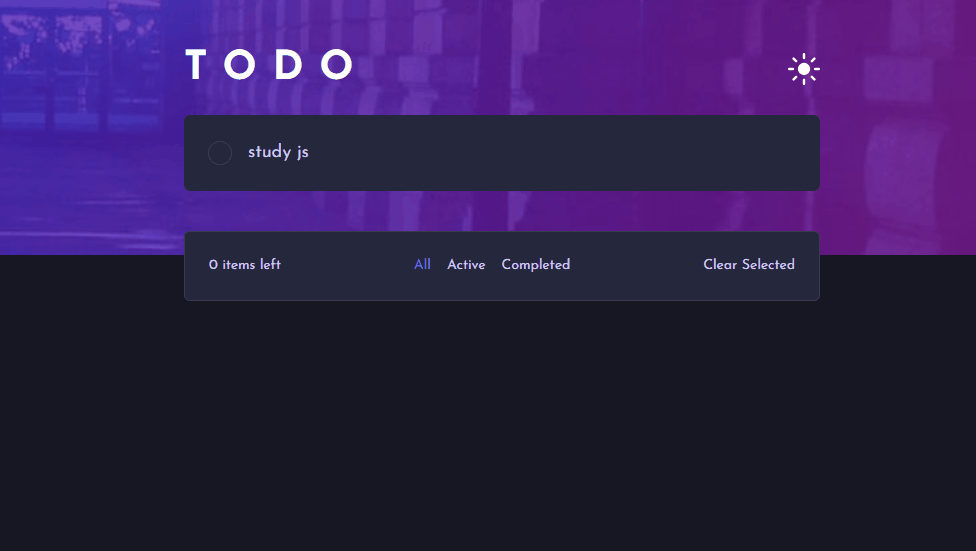

<h1 align="center">Task Manager ✔️ </h1>

<p align="center">
 Task management web application built with React, TypeScript, and Vite. It allows users to create, organize, and track tasks efficiently, focusing on productivity and user experience.
</p>

<p align="center">
  
</p>

<p align="center">  
  <a href="#-live-demo">Live Demo</a>&nbsp;&nbsp;&nbsp;|&nbsp;&nbsp;&nbsp;
  <a href="#-screenshots">Screenshots</a>&nbsp;&nbsp;&nbsp;|&nbsp;&nbsp;&nbsp;
  <a href="#-technologies">Technologies</a>&nbsp;&nbsp;&nbsp;|&nbsp;&nbsp;&nbsp;
  <a href="#-features">Features</a>&nbsp;&nbsp;&nbsp;|&nbsp;&nbsp;&nbsp;
  <a href="#-how-to-run">How to Run</a>&nbsp;&nbsp;&nbsp;|&nbsp;&nbsp;&nbsp;
  <a href="#-license">License</a>&nbsp;&nbsp;&nbsp;|&nbsp;&nbsp;&nbsp;
  <a href="#-contributing">Contributing</a>&nbsp;&nbsp;&nbsp;|&nbsp;&nbsp;&nbsp;
  <a href="#support">Support</a>  
</p>

<br>

## 🌐 Live Demo

<p align="center">
  <a href="https://react-task-manager-1xxu.onrender.com/">
    
  </a>
</p>

<p align="center">
  <sub>Tip: Use right-click → “Open in new tab”.</sub>
</p>

<br>

## 📸 Screenshots

<p align="center">
  
</p>

<br>

## 🛠 Technologies

- React
- TypeScript
- Vite
- Tailwind
- Git and GitHub

<br>

## ✨ Features

- Create new tasks
- View all registered tasks
- Mark tasks as completed
- Delete tasks
- Switch between Light and Dark themes
- Save theme preference in local storage
- Clean and user-friendly interface
- Built with React
- Deployed on Render

<br>

## ⚙ How to Run

### 1. Clone the repository

```bash
git clone <repository-url>
```

### 2. Navigate to the project directory

```bash
cd react-task-manager
```

### 3. Install dependencies

```bash
npm install
```

### 4. Start the development server

```bash
npm run dev
```

The application will be available at:

```text
http://localhost:5173
```

## Available Scripts

### Run the development server

```bash
npm run dev
```

### Build for production

```bash
npm run build
```

### Preview the production build

```bash
npm run preview
```

<br>

## 📜 License

* This project is licensed under the [MIT License](https://choosealicense.com/licenses/mit/)

<br>

## 🫱🏻‍🫲🏻 Contributing
<p> Contributions, issues, and feature requests are welcome! Please, feel free to do it! 😉 </p>

<br>

## 🌟 Support
<p> If you like this project, please give it a star ⭐ and share it with others! 😄 </p>
